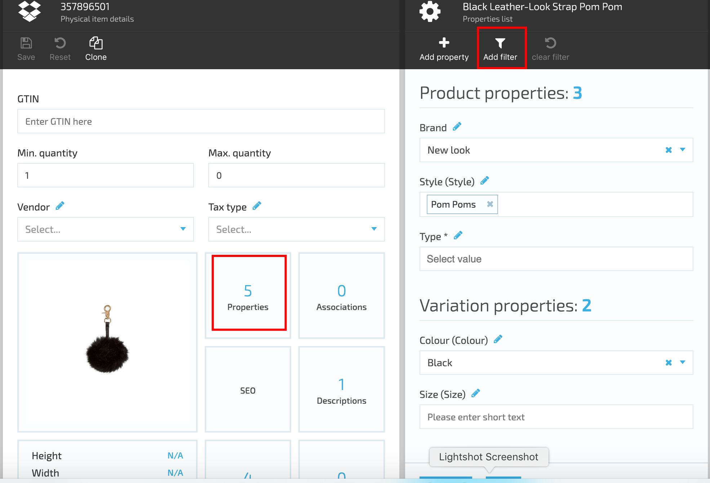
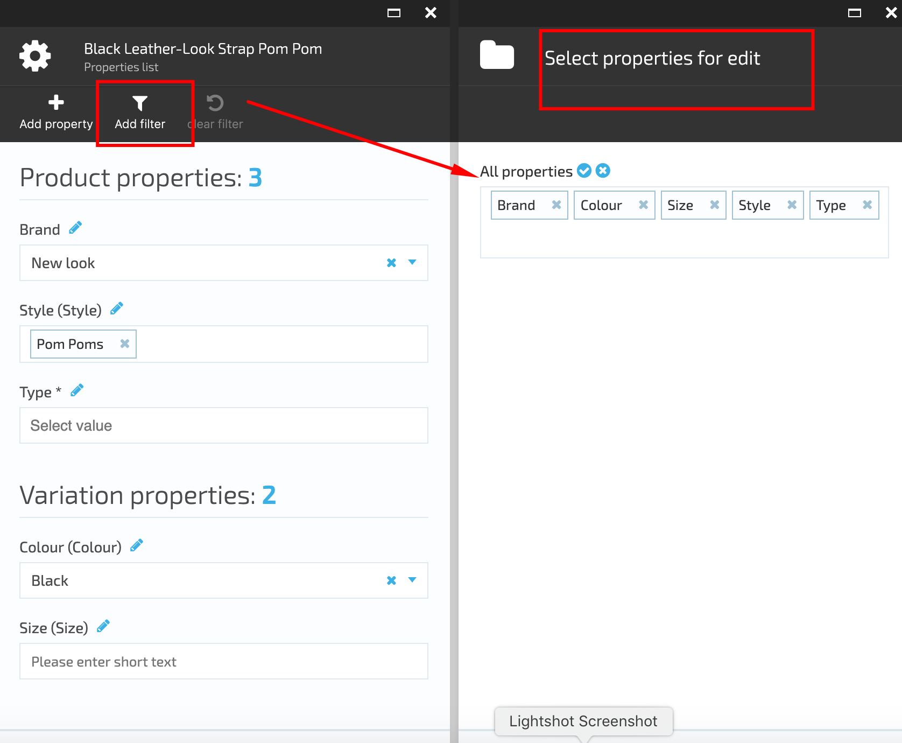

# View Properties

## View Catalog Properties

1. To view the Catalog properties, the user should select a Catalog, click on the three dots next to the Catalog name (on the left) and select 'Manage'
1. The system will display the 'Catalog details' blade
1. The user selects the 'Properties' widget and click on it
1. The system will display the Catalog list of properties

### Filter Visible Properties

1. Open Catalog Module→Select Catalog→Select Category→Select a product→open Properties widget;
1. The system will display the entire list of properties
1. Select 'Add filter';
1. All product properties with editing possibility will be displayed;
1. Remove the properties you don't need to manage from the list and click the 'OK' button;
1. The selected product properties will be then displayed on the Properties blade.

